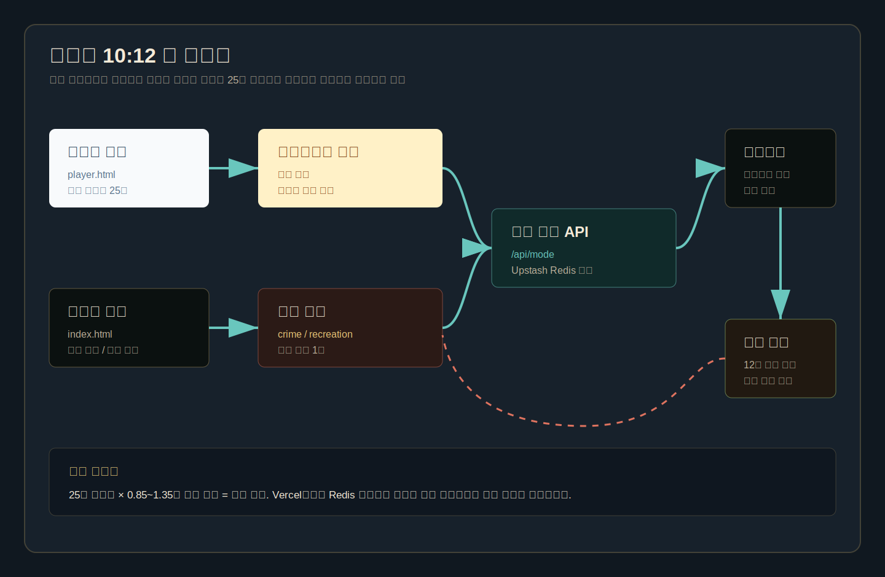
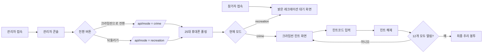

# 목양실 10:12 앱 흐름도

## 사용자 흐름

## 25대 동시 전환 설계

- 참가자 페이지는 `/api/mode`를 0.85~1.35초 랜덤 간격으로 확인합니다.
- 랜덤 지터가 있어 25대 휴대폰이 같은 순간에 요청을 몰아치지 않습니다.
- Vercel 배포 시 `UPSTASH_REDIS_REST_URL`, `UPSTASH_REDIS_REST_TOKEN`을 설정하면 모든 서버리스 인스턴스가 같은 상태를 읽습니다.
- 관리자는 버튼 클릭 한 번으로 Redis의 `crime-scene:mode` 값을 갱신합니다.
- 참가자 기기는 다음 폴링 때 `recreation` 또는 `crime` 상태를 받아 화면을 바꿉니다.

## 운영 화면

| 화면 | 역할 | 주요 액션 |
| --- | --- | --- |
| 관리자 `index.html` | 진행자가 사용하는 콘솔 | 모드 전환, 힌트코드 테스트, 정답 확인 |
| 참가자 `player.html` | 팀별 휴대폰 화면 | 레크레이션 대기, 크라임씬 진입, 힌트코드 입력 |
| 미리보기 `preview.html` | 리허설/디자인 확인 | 관리자와 참가자 화면을 한 화면에서 비교 |

## 완성도 개선 후보

- 관리자 비밀번호 또는 비공개 경로 추가
- 전환 3초 카운트다운 연출
- 참가자 팀명 입력 및 팀별 진행률 수집
- 힌트 오픈 로그 저장
- 최종 정답 제출 폼 추가
- Vercel KV/Upstash 연결 후 현장 리허설
